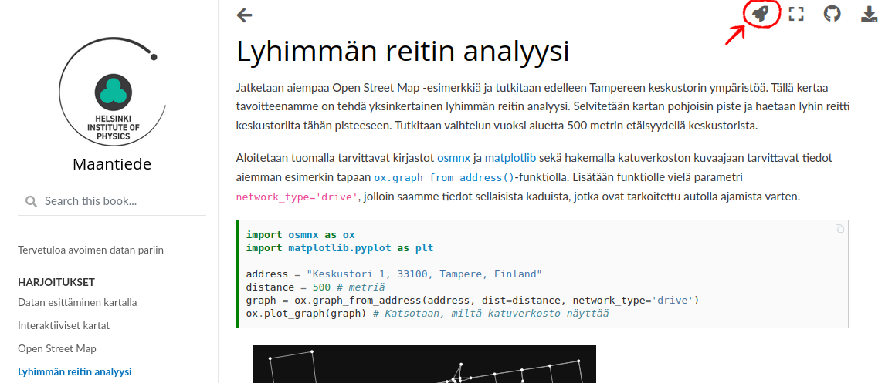

Välkommen att använda Open Data
===============================

På denna sida finns en samling undervisningsmaterial för matematik, grundat i Open Data.
Övningar hittas i indexbalken till vänster. När du öppnar en övning syns en förhandsgranskning.
Om du vill komma åt att ändra övningsdokumentet och testa dig fram själv kan du följa instruktionerna nedan.

### Starta en Notebook i Binder

1. Öppna en valfri notebook-övning i Jupyter Book genom menyn till vänster.
2. Klicka på raketsymbolen uppe till höger (se bilden nedan)
3. Klicka på "Binder"-knappen.
4. Notebooken öppnas nu i Binder. Detta kan ta ett par minuter, så var tålmodig.

